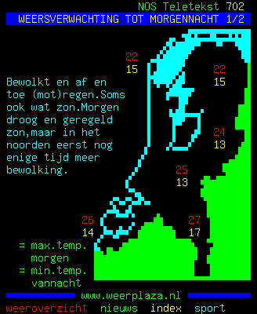

# Requirements
- GD
- dom
- mbstring

# Installation
```bash
composer require marijnvdwerf/teletekst
```

# Usage
```php
$data = file_get_contents('http://teletekst-data.nos.nl/json/702');
$data = json_decode($data);

$imageFormatter = new \marijnvdwerf\teletekst\ImageFormatter();
$gd = $imageFormatter->formatPage($data->content);
header('Content-Type: image/gif');
imagegif($gd);
```

An example for animated gifs can be found in [`animate.php`](animate.php)
